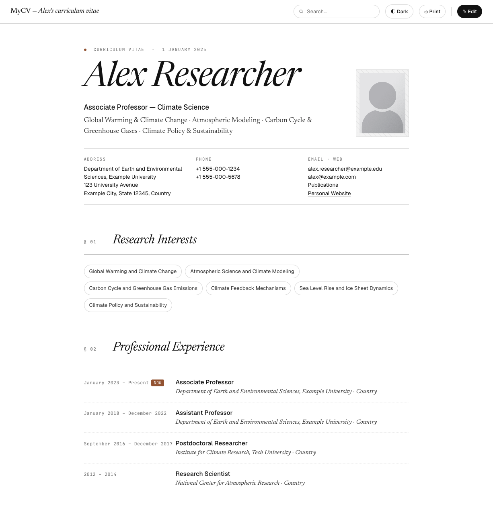

# MyCV

A simple, zero-build JavaScript web application for managing and displaying an academic CV in the browser.

## Features

- Renders a full academic CV from a single data file (`cv-data.js`)
- Live editing mode protected by a browser-side PBKDF2 + AES-GCM password
- Dark mode and print-friendly layout
- No build step — runs entirely in the browser via CDN-loaded React and Babel

## Prerequisites

- Python 3 **or** Node.js (for a local HTTP server)
- A modern browser (Chrome, Firefox, Safari, Edge)

> **Note:** The app must be served over HTTP, not opened as a `file://` URL, because the browser blocks cross-origin script loading for local `.jsx` files.

## Setup

1. **Clone the repository**

   ```bash
   git clone <repo-url>
   cd MyCV
   ```

2. **Start a local HTTP server**

   Using Python (built-in):
   ```bash
   python3 -m http.server 8080
   ```

   Or using Node.js (`npx`, no install required):
   ```bash
   npx serve .
   ```

3. **Open the app**

   Navigate to [http://localhost:8080](http://localhost:8080) in your browser.

## Customising your CV

All CV content lives in [`cv-data.js`](cv-data.js) as a plain JavaScript object (`window.DEFAULT_CV`). Edit the fields directly — changes take effect on the next page load.

Once you enable edit mode in the browser, any in-browser edits are saved to `localStorage` and take precedence over `cv-data.js`.

## Edit mode

1. Click the **Edit** button in the top-right corner.
2. On first use, you will be prompted to set a password. This password is never sent anywhere — it is used only to encrypt a verification token stored in your browser's `localStorage`.
3. Enter the password to unlock editing. Changes are saved automatically to `localStorage`.
4. To reset the password, clear `localStorage` for the site (DevTools → Application → Local Storage → Clear).

## Hosting on GitHub Pages

Because MyCV is a static site with no build step, it deploys to GitHub Pages with a single setting change.

1. **Push the repository to GitHub** (if not already there)

   ```bash
   git remote add origin https://github.com/<your-username>/MyCV.git
   git push -u origin main
   ```

2. **Enable GitHub Pages**

   - Go to your repository on GitHub.
   - Navigate to **Settings → Pages**.
   - Under *Source*, select **Deploy from a branch**.
   - Choose **main** branch and **/ (root)** folder, then click **Save**.

3. **Access your live CV**

   After a minute or two, your CV will be live at:
   ```
   https://<your-username>.github.io/MyCV/
   ```
   GitHub will show the URL in the Pages settings once the first deployment completes.

> **Note:** In-browser edits are stored in `localStorage`, which is tied to the browser and device. To update the published CV for everyone, edit `cv-data.js` and push a new commit.

## Snapshot



## Project structure

| File | Purpose |
|------|---------|
| `index.html` | Entry point; loads dependencies via CDN |
| `cv-data.js` | Default CV data |
| `cv-auth.js` | Password setup and verification (PBKDF2 + AES-GCM) |
| `app.jsx` | Root React component and routing |
| `display.jsx` | CV section components |
| `helpers.jsx` | Shared utility components |
| `styles.css` | All styling including dark mode and print layout |
| `assets/` | Static assets (headshot photo, etc.) |
